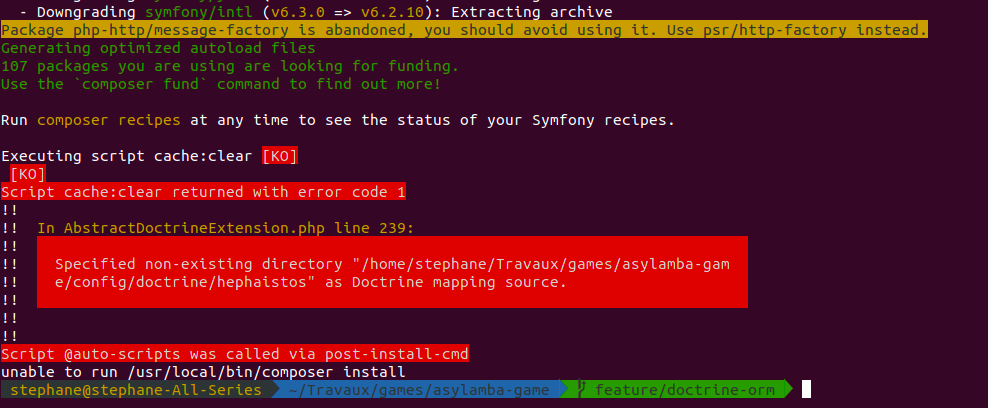
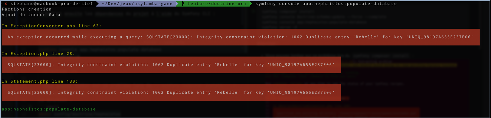

# Kalaxia

## Setup

### Requirements
- [Docker](https://docs.docker.com/engine/install/) and [Docker Compose](https://docs.docker.com/compose/install/)

### Procedure

First, clone the repository on your local environment :

```sh
git clone git@github.com:Kalaxia/game.git kalaxia
cd kalaxia
```

Launch the Docker containers using Docker Compose :

```shell
docker compose up -d
```

We recommend for your developments to use the `test` environment.

It will contain a minimum dataset to play with and to test your new features and bug fixes.

To do so, create a new `.env.local` file at the root of the project with the following content :

```dotenv
APP_ENV=test
```

Then, connect to the FPM container and install the project dependencies and setup the database :

```shell
# Equivalent of `docker exec -it kalaxia_app sh`
make cli
# Install the PHP dependencies
composer install
# Install the frontend dependencies
bin/console importmap:install
# Setup the database schema using Doctrine ORM
bin/console doctrine:database:create
bin/console doctrine:schema:update --force --complete
# Initialize a new game data in Kalaxia (players, map systems, planets...)
# If you launch this on
php -d memory_limit=-1 bin/console foundry:load-fixture -n test_environment
```

You will now be able to login with the following credentials :

- Username : `tester@example.org`
- Password : `test`

> If you want to create a new game, instead of loading fixtures in the `test` environment,
> you can use the `dev` environment and launch the command `bin/console app:hephaistos:populate-database`.
> In that case you will have to configure the game and create your own user accounts and characters before accessing the game.

If you are working on the UI, launch Tailwind watcher :
```shell
bin/console tailwind:build --watch
```

# Troubleshooting

### Failing ```symfony composer install``` :

#### Solution :
```shell
mkdir config/doctrine/hephaistos
```
---

### If the command `populate-database` fails, you try again and obtain this issue : 
#### Solution :

```shell
bin/console doctrine:schema:drop --force
bin/console doctrine:schema:update --force --complete
php -d memory_limit=-1 bin/console app:hephaistos:populate-database
```

> The commmand `populate-database` may take time.
