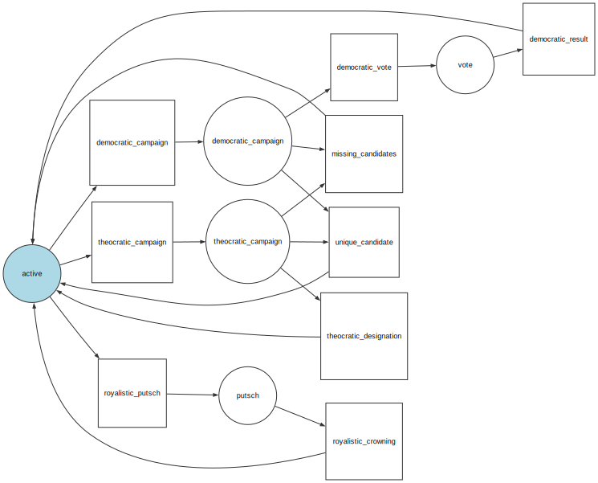

# Faction politics

## Senate

Each faction has a senate, which is composed of the most influential members of the faction.

The senate is responsible for voting the laws proposed by the government.

The senate is also responsible for managing the faction's resources, and for maintaining the faction's influence in the world.

## Government

## Regimes workflow

### Democratic regimes

The democratic regimes choose their leader amongst candidates from the senate.

The leaders have time-limited mandates and the elections are held at regular intervals.

When the campaign begins, the senators can declare themselves as candidates.

If there are multiple candidates, all the faction members can vote for their preferred candidate.

If there is only one candidate, this candidate is automatically proclaimed leader.

There is a delay between the end of the election and the beginning of the mandate,
which allows the former leader to end his time whatever the election outcome.

### Theocratic regimes

The theocratic regimes rely on the divine decision to choose the leader of the faction.

Like the democratic regimes, the leaders have a time-limited mandate.

When the campaign begins, the senators can declare themselves as candidates.

There is no vote however, and the leader is chosen by the divine decision, which is a random process (but saying so is heresy).

### Royalistic regimes

The royalistic regimes are the simplest. There are no any notion of mandates.

The senators can orchestrate a coup, which triggers a vote of all faction members to either accept or reject the putschist.
If the putschist is accepted, he becomes the new leader of the faction.
If not, the previous leader remains in power.
